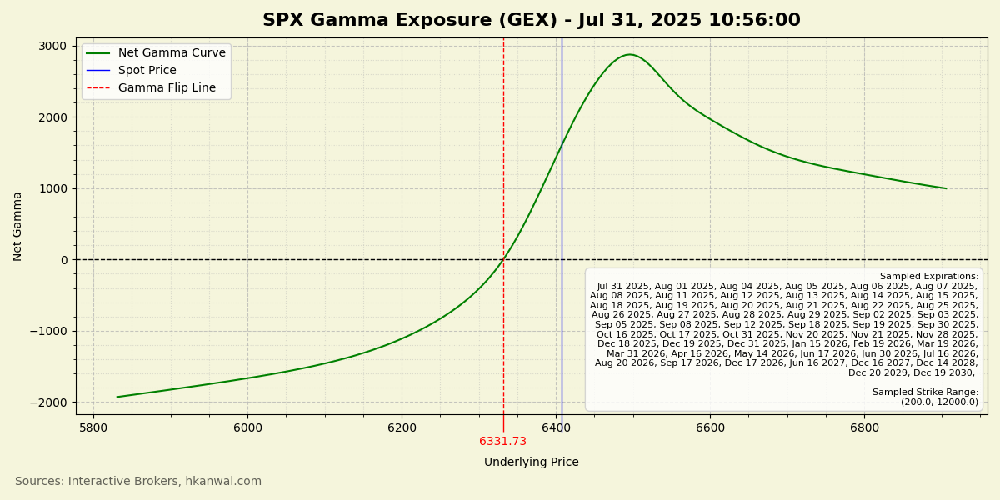

#### Requirements

- Funded Interactive Brokers (IB) account
- IB TWS or IBKR Gateway installed
- Live market data subscriptions
- CUDA and CuPy (`cupy-cuda11x` or `cupy-cuda12x`) for faster runtimes using GPU parallelization

#### Usage

Run `python GEX_curve.py` while IB TWS or IBKR Gateway are open and connected.

#### Expected Runtime

Collection of ALL options on SPX option chain (20k+ requests) is expected to take ~40-70 minutes.

#### Example Output

